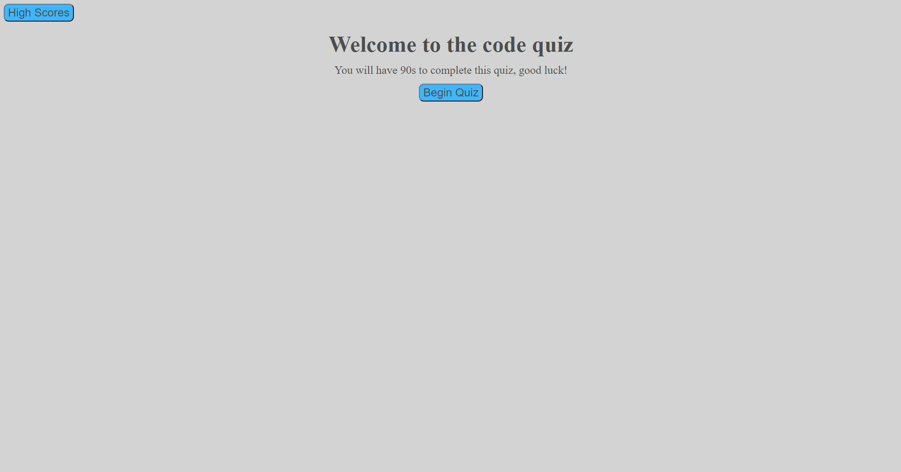
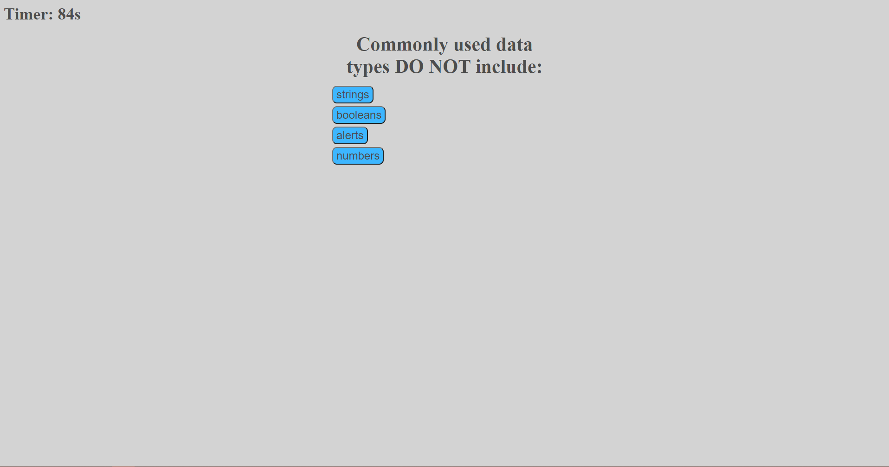

# Code-Quiz
## Description
This quiz will let you answer some questions while counting down a timer. If the timer reaches 0 the quiz ends, or if you complete every question your remaining time can be logged with a name that is saved locally.
## Installation
Cloning the repository from https://github.com/MHranek/Code-Quiz or using the deployed link https://mhranek.github.io/Code-Quiz/
## Usage
Clicking begin quiz will start the quiz, at the end you can type in a name to save your score to, and from there or the main page you can look up the list of high scores.

